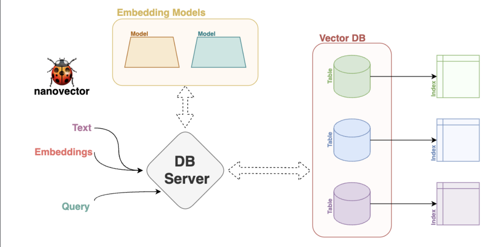

# 🐞 NanoVector: Efficient Vector Database with NumPy

NanoVector is a lightweight, NumPy-powered vector database. It simplifies vector data storage and retrieval, making it perfect for embeddings and high-dimensional data.
gt

## 🙋‍♀️ Why NanoVector?

**Vector databases**, like NanoVector, are essential for:

1. **High-Dimensional Data:** Storing complex, multi-dimensional vectors efficiently.

2. **Distance Calculations:** Quickly find similarities or distances between vectors.

3. **Scalability:** Handle large datasets effortlessly.

NanoVector excels because it's:

- **Lightweight:** Minimalist and easy to integrate, 
  
- **Efficient:** Speedy storage and retrieval using barebone numpy.

- **Dockerized:** Easily deploy NanoVector in containerized environments.

- **Direct Text to Vector Pipeline:** Seamlessly convert text data into vectors within the database.

- **Versatile:** Ideal for embeddings, features, and more.

- **Open Source:** Customizable and transparent.

## 🎨 Features
NanoVector offers the following key features:
- Efficient vector storage and retrieval.
- Dockerized for easy deployment.
- Direct pipeline for converting text to vectors.
- Integration with Sentence Transformers for powerful embeddings.
- PCAIndex for scaling high dimensional embeddings.

## 🍥 System Design




## ⛏️ Set-up
### 🐳 Docker
Assuming you have docker installed, you can easily use docker to setup the vector server.

1. Pull the Docker image from Docker Hub:
   ```bash
   docker pull aviaswal/NanoVector
   ```
   
2. Run the image now,
   ```bash
   docker run aviaswal/NanoVector
   ```
The server will be running on `localhost:5000` now.

### 🐙 GitHub
Follow the steps below to setup the repository and run the server.

1. Clone the repo
   ```bash
   git clone https://github.com/aviaswal77/NanoVector.git
   cd NanoVector
   ```
3. Create a conda environment, and activate it
   ```bash
   conda create -n NanoVector
   conda activate NanoVector
   ```
5. Install dependencies
   ```bash
   pip3 install -r requirements.txt
   ```
7. Run the server
   ```bash
   python3 -m app.app
   ```
The server will be running on `localhost:5000` now.

## 📜 API Documentation
API Documentation is available in the [app directory](https://github.com/aviaswal77/NanoVector/blob/main/app/README.md).
## 🧪 Testing
Once you have `pytest` installed, test using:
```bash
pytest
```

## 🍼 TODO
- [ ] Add tests for PCAIndex
- [ ] Include more similarity metrics


## 📇 Contact
Contact me on [Linkedin](https://www.linkedin.com/in/avi-aswal/), drop an [email](mailto:aswal@usc.edu).
